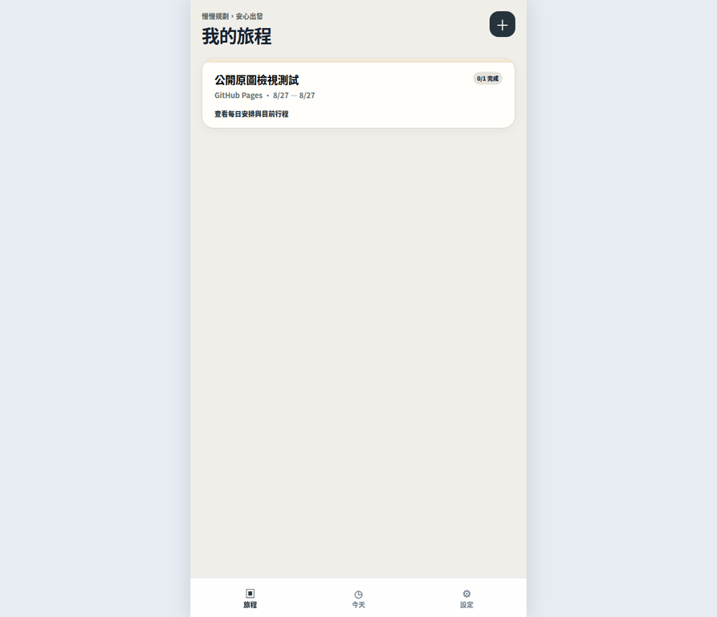
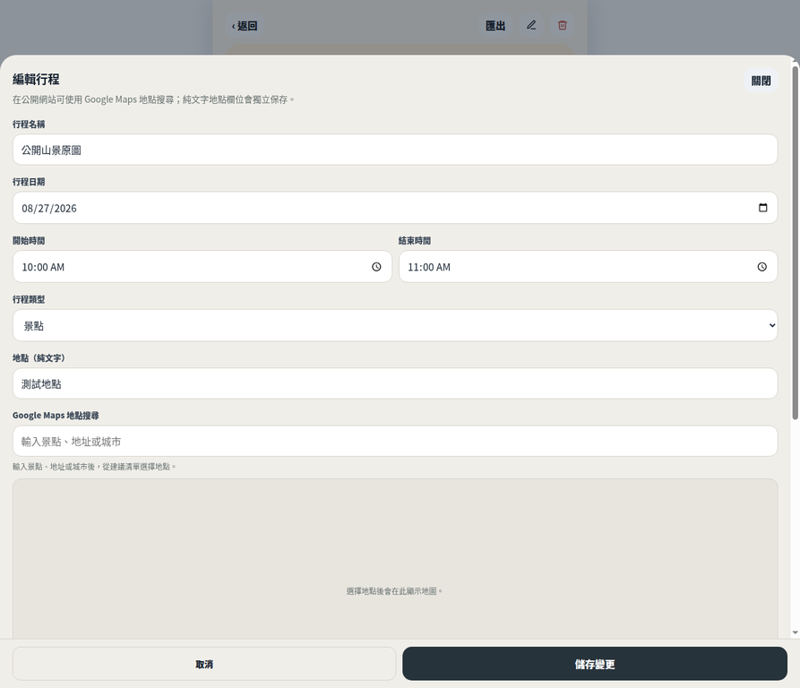
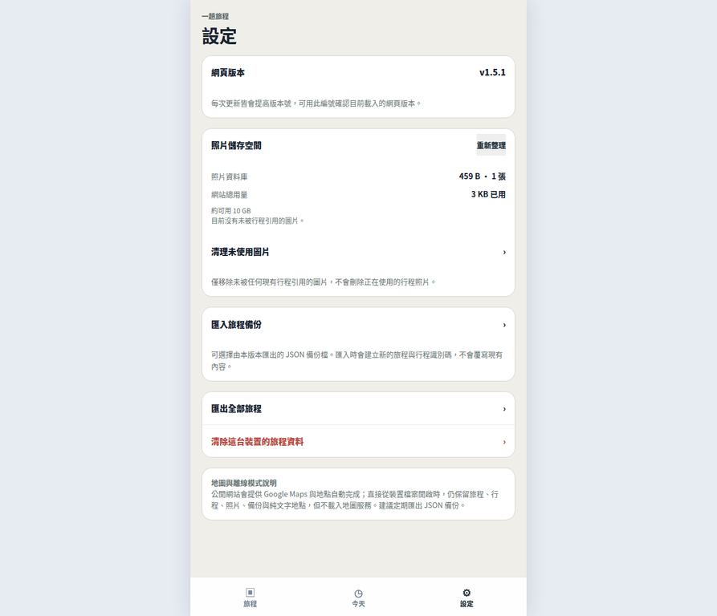

# 一趟旅程

> **手機優先的單一 HTML 旅程規劃工具。** 建立旅程、安排每日活動、保存景點照片、管理地圖位置，並將完整行程以 JSON 備份帶著走。

[開啟公開版本](https://allen5103.github.io/journey/) · [查看最新版本](https://allen5103.github.io/journey/?v=1.7.2)

目前公開版本：**v1.7.2**。單一行程卡片會在同一右側直欄由上而下顯示行程類別、編輯與刪除按鈕，三個控制項統一為 30px 高度及 4px 固定間距，兩個 SVG 操作圖示維持相同主題墨綠色。首次在線開啟後，公開網站會快取應用程式殼層；離線時左下角顯示「目前離線中」，並隱藏 Google Maps、地點搜尋與 Google Maps 外連介面。請在應用程式的「設定」頁查看實際載入的版本號。

## 目錄

- [快速開始](#快速開始)
- [操作畫面](#操作畫面)
- [完整功能](#完整功能)
- [資料照片與備份](#資料照片與備份)
- [公開網站與離線檔差異](#公開網站與離線檔差異)
- [常見問題與限制](#常見問題與限制)
- [儲存庫內容](#儲存庫內容)

## 快速開始

開啟網站後，按右上角 **＋** 建立第一趟旅程。填寫旅程名稱、目的地、起迄日期並選擇旅程色彩；建立後可依日期加入行程。每筆行程可以填寫開始與結束時間、行程類型、地點、地圖搜尋、備註及照片。

當同一天有多筆行程時，工具會依開始時間排序，並在相鄰行程之間計算空檔時間。進入旅程詳情時，若當日正在旅行中，系統會依裝置時間標示「現在進行中」或「下一個行程」，並定位到對應日期。

| 想完成的事情 | 操作方式 |
|---|---|
| 建立旅程 | 旅程首頁按 **＋**，填寫名稱、目的地、日期與色彩後按「建立旅程」。 |
| 加入活動 | 進入旅程後，選擇日期並按「＋ 加入行程」。 |
| 編輯或刪除 | 在活動卡片右側使用鉛筆或垃圾桶圖示。 |
| 查看今天行程 | 點擊底部「今天」，系統會整理當日所屬旅程。 |
| 備份資料 | 旅程詳情按「匯出」，或至設定頁按「匯出全部旅程」。 |

## 操作畫面

### 1. 旅程首頁

首頁列出所有旅程，顯示目的地、日期與完成進度。按旅程卡片可進入每日時間軸；底部導覽可切換「旅程」、「今天」與「設定」。

### 2. 新增或編輯行程

行程表單採原生日期與時間選擇器。**行程類型**可選擇景點、餐飲、交通、住宿、購物或其他；純文字地點與 Google Maps 搜尋欄位分開保存，因此選擇地圖建議不會覆寫自行輸入的地點文字。

### 3. 三張照片與全螢幕檢視

單一行程最多可保存三張照片。編輯頁會並排顯示全部縮圖；點擊縮圖可開啟深色全螢幕檢視器，使用左右按鈕切換照片。行程卡片只顯示第一張縮圖，使每日清單維持簡潔。每張照片右上角的 **×** 會在確認後立即移除該照片。

### 4. 設定與儲存維護

設定頁顯示網頁版本、照片資料庫用量、網站總用量與瀏覽器提供的可用空間估算。若先前操作留下未被任何行程引用的照片，可使用「清理未使用圖片」安全釋放空間。

## 完整功能

### 旅程與每日安排

旅程可新增、編輯、刪除，並從參考色票的八個 Pantone 網頁近似色中選擇視覺色彩。介面以 2026 Cloud Dancer 與 Almost Aqua 的雙色語彙呈現；建立或編輯旅程時，八個無文字圓角色塊會以單列方式顯示，並保留無障礙名稱與明確選取標示。單一旅程有出發日與返程日保護；活動日期必須位於旅程期間內，結束時間必須晚於開始時間。

活動卡片會顯示時間區間、行程類型、純文字地點、備註與照片首圖。備註中的 HTTP／HTTPS 網址會轉為可直接開啟的連結。完成活動可用左側勾選按鈕切換；系統會依時間顯示相鄰活動的空檔時長。

| 欄位 | 說明 |
|---|---|
| 行程名稱 | 活動的主要名稱，例如「清水寺晨間參拜」。 |
| 行程日期與時間 | 使用原生日期與時間選擇器，構成每日時間軸與空檔計算。 |
| 行程類型 | 景點、餐飲、交通、住宿、購物、其他；會顯示在活動卡片。 |
| 地點（純文字） | 自行撰寫的地址、集合點或提示，不受地圖搜尋影響。 |
| Google Maps 地點搜尋 | 僅公開網站提供自動完成、地圖預覽與外部 Google Maps 開啟連結。 |
| 備註 | 可保存預約、交通、提醒與網址。 |

### 地圖與地點搜尋

在公開網站版本，行程表單可使用 Google Maps Places 自動完成搜尋地點。從建議中選取項目後，系統保存座標與地圖搜尋文字，並在行程詳情顯示地圖預覽及「在 Google Maps 開啟」連結。

地圖搜尋與純文字地點刻意分開：前者適合導航與座標，後者適合保存使用者自己的集合說明、旅館入口或備註名稱。

### 照片管理

照片在匯入時會縮小與壓縮為 JPEG Blob，再保存於瀏覽器的 IndexedDB。這避免把手機原始照片直接塞入 Local Storage，降低整份行程快照因圖片過大而無法保存的風險。

每個活動最多三張照片。若照片儲存、行程快照或容量檢查失敗，系統不會把尚未成功保存的表單變更偽裝成成功；既有快照會保留，使用者可調整後重試。移除單張照片、刪除活動或刪除旅程時，對應的圖片 Blob 也會一併清理。

## 資料照片與備份

所有資料都保存在**目前瀏覽器與目前網站來源**。公開網站 `https://allen5103.github.io/journey/` 與直接從檔案開啟的 `file://` HTML 屬於不同來源，因此各自擁有獨立資料；要在兩者之間移轉，請使用 JSON 匯出／匯入。

| 資料類型 | 儲存位置 | 用途 |
|---|---|---|
| 旅程、活動、日期、地點與設定 | Local Storage | 保存小型行程索引與完整文字資料。 |
| 行程照片 | IndexedDB | 以 JPEG Blob 保存最多三張照片，減少 Local Storage 容量壓力。 |
| 匯出備份 | JSON 檔案 | 匯出時將照片轉成可攜 Base64；匯入時還原為新的 IndexedDB Blob。 |

### 匯出與匯入

**匯出單一旅程：** 在旅程詳情右上角按「匯出」。

**匯出全部資料：** 至「設定」頁按「匯出全部旅程」。

**匯入備份：** 至「設定」頁按「匯入旅程備份」，選擇先前匯出的 JSON。匯入會建立新的旅程與活動識別碼，不會覆寫現有資料。含照片的備份檔會較大，因 Base64 便於攜帶但會增加檔案大小；匯出後請確認檔案已保存於「檔案」App 或其他安全位置。

> **建議：** 在清除瀏覽器資料、轉換裝置、改用新瀏覽器或進行大量照片整理前，先匯出全部旅程。

### 儲存空間與清理

設定頁的「照片儲存空間」會列出照片資料庫張數與容量，並使用 `navigator.storage.estimate()` 顯示瀏覽器提供的網站用量與可用空間估算。若此 API 未提供數值，工具會明確顯示無法取得，而不會虛構容量。

「清理未使用圖片」只會掃描沒有被任何現有活動 `imageIds` 引用的 IndexedDB Blob。工具會先顯示預計清理的張數與可釋放容量，確認後才執行；正在使用的活動照片不會被移除。

## 公開網站與離線檔差異

| 功能 | 公開網站 | 下載 `index.html` 後直接開啟 |
|---|---|---|
| 旅程、活動、時間、類型、照片、JSON 備份 | 支援 | 支援 |
| Google Maps 地圖預覽 | 在線時支援；離線時隱藏 | 不載入 |
| Google Places 地點自動完成 | 在線時支援；離線時隱藏 | 不載入 |
| 本機資料範圍 | `https://allen5103.github.io` 的瀏覽器資料 | `file://` 的瀏覽器資料；與公開網站分開 |
| 網路需求 | 首次需在線開啟以完成快取；其後旅程、行程、照片與 JSON 備份可離線使用 | 不使用地圖時可離線使用 |

公開網站首次在線開啟後，請等待頁面完成載入，再重新載入一次以完成 Service Worker 控制；此後沒有網路時仍可開啟已快取的網站。離線時會顯示「目前離線中」，且地圖相關介面會隱藏；旅程、行程、照片、時間與 JSON 備份仍可使用。若要使用獨立檔案，亦可下載本儲存庫中的 `index.html`，在 iPhone「檔案」App 或其他瀏覽器可開啟的方式載入。若要攜帶公開網站既有旅程，請先在公開網站匯出 JSON，再於離線檔匯入。

## 常見問題與限制

### 為什麼換裝置或換瀏覽器後看不到旅程？

本工具不使用帳號或雲端同步。資料只存在建立資料的瀏覽器與網站來源中；請使用 JSON 匯出／匯入移轉。

### 為什麼本機 HTML 沒有地圖？

直接從檔案系統開啟時，為了保持離線可用與避免地圖服務在 `file://` 環境載入失敗，工具會停用 Google Maps 與自動完成。公開網站版本可使用這些功能。

### 可以保存多少照片？

每個行程最多三張。實際總量取決於裝置、瀏覽器的可用儲存空間及既有網站資料。工具會壓縮新照片並在設定頁顯示用量；大量照片請分批加入並定期備份。

### 清除瀏覽器資料後還能復原嗎？

若沒有事先匯出 JSON 備份，通常無法復原。因此請在瀏覽器資料清除、系統重置或更換裝置前先備份。

## 儲存庫內容

| 檔案／目錄 | 用途 |
|---|---|
| `index.html` | 完整單一 HTML 應用程式，內嵌樣式、互動與公開網站地圖設定。 |
| `README.md` | 本功能與操作說明書。 |
| `docs/images/` | README 使用的實際操作截圖。 |
| `.github/workflows/deploy-pages.yml` | GitHub Pages Actions 發布工作流程。 |
| `.nojekyll` | 避免 GitHub Pages 以 Jekyll 處理靜態檔案。 |

## 版本與回報

請在設定頁確認目前網頁版本，並於回報問題時一併提供版本號、使用裝置／瀏覽器、操作步驟與是否使用公開網站或本機 HTML。這能更快判斷問題是否與瀏覽器儲存空間、來源差異或網路地圖服務有關。
